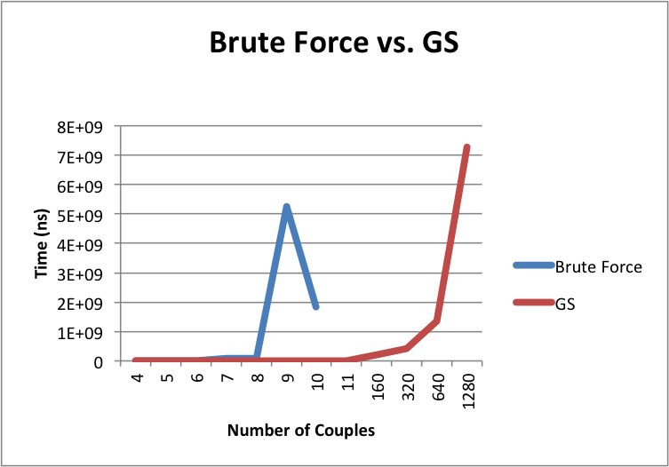

# Lab 1 -- Stable Marriage Problem

* Jeremy Castillo
* jcc4428

## Part 1

### a, b, c
To prove there always exists a perfect matching is weakly stable it suffices to find an algorithm, and prove its correctness. 

*b)*

**Algorithm:**
*A - set of all apartments, T - set of all tenants*
	
	Initially all a in A, all t in T are free 
	
	while there is a tenant t who if free and hasn't tried to rent every apartment
		Choose such a tenant t
		Let a be the highest-ranked apartment in t's preference list to which t hasn't tried to rent
		if a is free then
			(t,a) become paired
	
		else a is currently paired to t'
			
			if landlord owning a prefers t' to t then 
				t remains free

			else landlord owning a prefers t to t'
				(t,a) become paired
				t' becomes free
			endif

		endif
		remove a from t preference list it does not try to pair with it again
	endwhile
	return set of pairs

*a/c)*

Now to show this always returns a perfect matching that is weakly stable we need to prove it's correctness. This requires proving the algorithm terminates and gives a correct result.

**Terminates:**

To prove the algorithm terminates it is helpful to define a measure of progress. Progress in this case will be defined with P(.) where P(t) represents the number of pairs (t,a) such that t has tried to rent a at the end of iteration t. Then for p(t+n), where n > 0, the size of P(t+n) is greater than P(t). This is because every iteration has a tenant t trying to rent one apartment. But since there are k tenants and k apartments there are k^2 possible pairs in total. Since one iteration increases the number of pairs for a tenant t by one the highest number of iterations that can occur are k^2. Therefore, the maximum number of iterations is k^2 and the algorithm terminates.

**Correctness:**
	
First one needs to prove the algorithm returns a perfect matching. Suppose the algorithm finished with a free tenant t. 

Since the algorithm terminated it is the case that t tried to pair with every apartment. So if the tenant did try to pair with every apartment and did not pair up after that it implies each apartment is matched with a tenant. Since there are n tenants and apartments then every one is matched (which is a perfect matching) but also there is a tenant free. This is a contradiction. So the loop cannot exit with a free tenant. 

So if the algorithm did terminate with a free tenant it contradicts the paragraph above, so there cannot be a free tenant who has tried to pair with every apartment. Thus the matching is perfect.  

Since S it is a perfect matching to prove it is a weakly stable matching I'll start by assuming there exists an instability, and use this to obtain a contradiction. An instability in this case would occur if:

	two pairs: (t, a') and (t', a)
	t prefers a to a'
	a prefers t to t'

Prefer in this algorithm stricly means there is a higher preference (which means a tenant ranks apartment 0 as a 1 and apartment 2 as a 3 i.e. tenant prefers apartment 0) and ties (tenant ranks apartment 0 and 1 as 2, so the only way tenant will leave either of those apartments is if he ranks another apartment as a 1) will not be treated as a higher preference.

In the execution of the algorithm, t last tried to pair with a'. So did t ever propose to a? If t didn't, then a' is higher on t's preference list. However, this contradicts the preference list of t we started with. If t did, then t did not pair with a because a was paired with some other tenant t'' which a stricly prefers to t. So either t'' is t' or a strictly prefers t' to t''. Either way this contradicts a's preference list where a prefers t to t'. Therefore it is a weakly stable matching. 

By proving the algorithm terminates and returns a correct result we have shown there always exists a perfect weakly stable matching.

### d

To prove the algorithm terminates it is helpful to define a measure of progress. Progress in this case will be defined with P(.) where P(t) represents the number of pairs (t,a) such that t has tried to rent a at the end of iteration t. Then for p(t+n), where n > 0, the size of P(t+n) is greater than P(t). This is because every iteration has a tenant t trying to rent one apartment. But since there are k tenants and k apartments there are k^2 possible pairs in total. Since one iteration increases the number of pairs for a tenant t by one the highest number of iterations that can occur are k^2. Therefore, the maximum number of iterations is k^2 and the algorithm terminates. So the algorithm is O(n^2).

### e

The brute force algorithm is O(n!). This is because to find all the permutations of n tenants and apartments being paired you first start with n and find all the combinations. Then you subtract 1 and find all the combinations. The worst case is you don't find a combination and go through all the permutations. This means (n)(n-1)(n-2)...(3)(2)(1) which is n!. In addition since the isStableMatching method takes O(n^2) because if the matching is stable you have to check all the cases where a tenant prefers another apartment to its current pair. Since there are n tenants and n apartments this leads to O(n^2). Finally, this method is called for every permutation and since there are a total of n! permutations the upper bound on the time complexity of the brute force method is O(n! * n^2). 

### f

