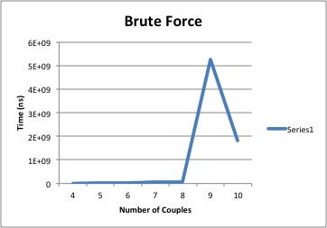
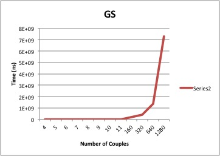

# Lab 1 -- Stable Marriage Problem

## Part 1

### a, b, c
To prove there always exists a perfect matching is weakly stable it suffices to find an alogorithm, and prove its correctness. 

*b)*

**Algorithm:**
	*A - set of all apartments, T - set of all tenants*
	
	Initially all a in A, all t in T are free 
	
	while there is a tenant t who if free and hasn't tried to rent every apartment
		Choose such a tenant t
		Let a be the highest-ranked apartment in t's preference list to which t hasn't tried to rent
		if a is free then
			(t,a) become paired
	
		else a is currently paired to t'
			
			if landlord owning a prefers t' to t then 
				t remains free

			else landlord owning a prefers t to t'
				(t,a) become paired
				t' becomes free
			endif

		endif
		remove a from t preference list it does not try to pair with it again
	endwhile
	return set of pairs

Now to show this always returns a perfect matching that is weakly stable we need to prove it's correctness. This requires proving the algorithm terminates and gives a correct result.

*a/c)*

**Terminates:**

To prove the algorithm terminates it is helpful to define a measure of progress. Progress in this case will be defined with P(.) where P(t) represents the number of pairs (t,a) such that t has tried to rent a at the end of iteration t. Then for p(t+n), where n > 0, the size of P(t+n) is greater than P(t). This is because every iteration has a tenant t trying to rent one apartment. But since there are k tenants and k apartments there are k^2 possible pairs in total. Since one iteration increases the number of pairs for a tenant t by one the highest number of iterations that can occur are k^2. Therefore, the maximum number of iterations is k^2 and the algorithm terminates.

**Correctness:**
	
	a Proof the return set is a perfect matching. 
	Suppose the algorithm 

### d

### e

### f

