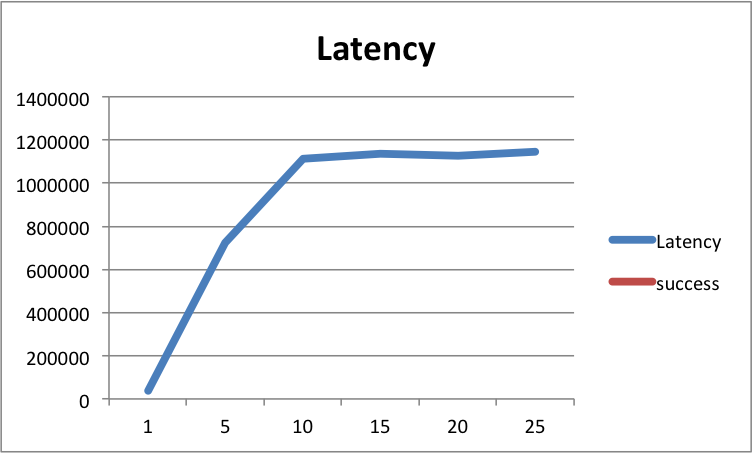

# Lab 2 -- Dijkstra Algorithm

* Jeremy Castillo
* jcc4428

## Part 3

### Proofs

*(a)*

GPSR is greedy because it is making locally optimal decisions toward a globally optimal solution. This decision is made at each node. If the sink's distance is within the transmission range, then GPSR finishes. If the sink's distance is outside the transmission range, then GPSR chooses the next node to visit (the hop) by looking at all the nodes within it's transmission range and picks the node closest to the sink node. GPSR never goes back to reconsider any the hops it goes to, and this is how the algorithm breaks the main problem into smaller problems. 

However, GPSR is not optimal because it only builds the solition based on the geometric distance between nodes. It does not take into account the latency between nodes. 

For example there could be a graph with six vertices. Using GPSR the shortest non optimal path to the sink could be x vertices long but have a total latency of A. But there could exist another path to the sink with y vertices and have a total latency of B. Assume A > B. Then GPSR found the shortest path there exists another path with a lower latency. 

*(b)*

### Runtime Efficiency

*(a)*

I used an array list of array lists to represent the graph with an adjacency list. The outer list corrersponds to each of the vertices in the 'location' arraylist created by the VertexNetwork class. Then each of the vertices' list contains all the edges to whihc each vertex is adjacent with. In this problem, for two vertices to be adjacent their distance has to be less then the transmission range. The memory space efficiency of my representation is O(V + E).

*(b)*

I have a function called maekAdjacencyDijkstraList(...) which makes the adjacency list for the program.

    for each vertex v in the location array list
        add new arraylist for v

    for each edge e in the edges array list
        get vertices v1 and v2 of e
        if v1.distance(v2) < transmission range
            add v1 to v2 adjacency list
            add v2 to v1 adjacency list

The first for loop is O(V) because it creates an array list for each of the vertices. The second loop is O(E) because it checks all possible edges for this graph and adds the valid ones to the graph representation.

*(c)*

The runtime complexity of my implementation of Dijkstra's algorithm is O(V^2). This is because the algorithm uses a find min function, which finds the smallest distance in the unvisited vertices list. This takes O(V) time. In the worst case this happens for all the vertices, which makes the runtime complexity O(V^2).

### Runtime Efficiency and Success Rate

